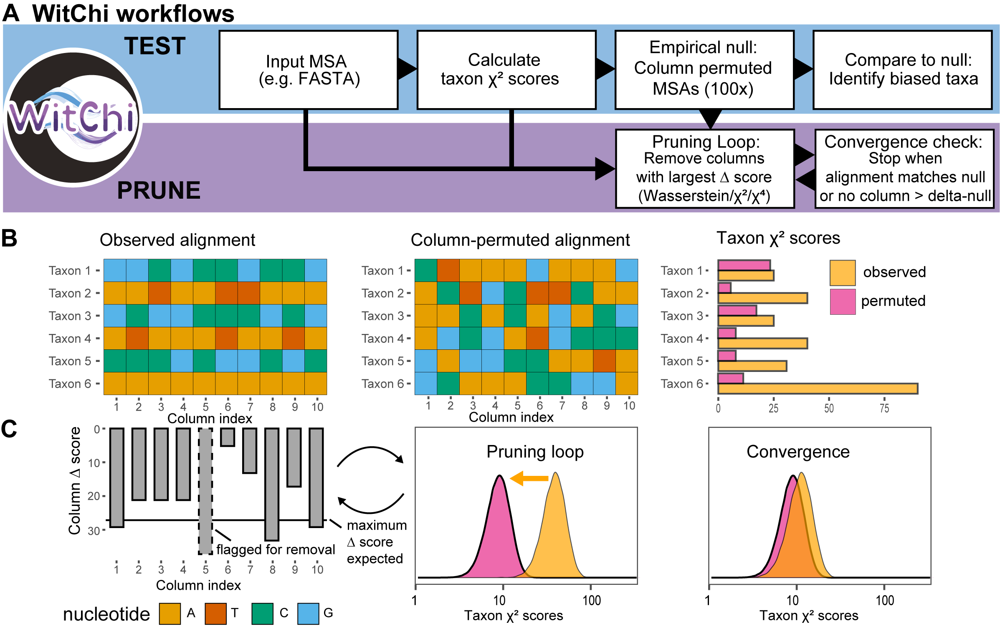

# WitChi: A Compositional Bias Testing and Pruning Tool for Multiple Sequence Alignments using Chi-squared Statistics


WitChi detects and prunes compositionally biased columns in multiple sequence alignments (MSAs) using empirical chi-squared testing.


## Key Features
* **Empirical null via column permutation** — chi-squared thresholds derived from the alignment itself, no parametric assumptions.
* **Three pruning algorithms**: squared (Δχ²), quartic (Δχ⁴), Wasserstein (W₁ on Z-score quantiles).
* **Per-column delta-null stopping**: halts pruning when no column's Δχ² exceeds what a homogeneous alignment of the same size and composition would produce.
* **Parallelised** via joblib (independent permutations and per-column delta scoring).



Overview of the WitChi workflows for detecting and reducing compositional bias in multiple sequence alignments. (A) The 'test' workflow (blue background) computes taxon-specific χ² scores and builds an empirical null distribution by column permutation (100×), identifying biased taxa. The 'prune' workflow (purple background) iteratively removes the alignment columns with the highest Δ-score — defined by the active scoring algorithm (squared, Δχ²; quartic, Δχ⁴; or Wasserstein, ΔW) — followed by a convergence check that halts pruning once the alignment-level empirical p-value exceeds 0.05 or no remaining column's Δ-score exceeds the per-column delta-null (whichever occurs first). (B) An example observed MSA and one corresponding column-permuted MSA, showing how taxon-specific composition is homogenized while the column-wise (global) residue distribution is preserved; the bar plot at right compares taxon χ² scores between the observed and permuted alignments. (C) Left: per-column Δ-scores for the observed alignment in (B), with the most biased column flagged for removal (dashed box) when its Δ-score exceeds the maximum expected under the permuted null. Middle (pruning loop): the density of taxon-specific χ² scores shifts from the observed alignment (orange) toward the permuted null (pink) as columns are removed. Right (convergence): once the stopping criterion is met, pruning halts and the observed taxon χ² distribution overlaps the permuted null.

## Installation
```bash
conda env create -f environment.yml
conda activate witchi
```

To add witchi to an existing conda env, include this in your `environment.yml`:
```yaml
- pip:
    - git+https://github.com/stephkoest/witchi
```

For development (editable install + tests):
```bash
git clone https://github.com/stephkoest/witchi.git
cd witchi
conda env create -f environment.yml
conda activate witchi
pip install -e .
pytest tests/
```

## Usage
### Pruning Alignment
Prune alignment columns recursively based on Chi-square test:

```bash
witchi prune --file alignment.fasta --format fasta --max_residue_pruned 100 --permutations 100 \
  --num_workers_chisq 2 --num_workers_permute 1 --top_n 2
```

#### Options:
- `--file`: Path to the alignment file.
- `--format`: Alignment file format (default: fasta).
- `--max_residue_pruned`: Maximum columns to prune (default: 100).
- `--permutations`: Number of permutations for empirical distribution (default: 100).
- `--num_workers_chisq`: Number of CPU threads for chi-square calculations (default: 1).
- `--num_workers_permute`: Number of CPU threads for permutation parallelization. Controls both the main permutation test and the delta-null permutation loop (default: 1).
- `--top_n`: Number of top biased columns to prune per iteration (default: 1).
- `--pruning_algorithm`: Pruning algorithm to use (squared, wasserstein, quartic; default: wasserstein).
- `--delta-null` / `--no-delta-null`: Enable/disable the delta-null stopping criterion (default: enabled; see section below).

### Permutation Testing
Run permutation tests to establish empirical Chi-square distributions:
```bash
witchi test --file alignment.fasta --format fasta --num_workers_permute 2 --permutations 100 --create_output
```

#### Options:
- `--file`: Path to the alignment file.
- `--format`: Alignment format (default: fasta).
- `--num_workers_permute`: Number of CPU threads (default: 1).
- `--permutations`: Number of permutations (default: 100).
- `--create_output`: Flag to create output file with z-scores and empirical p-values per taxon.

## Pruning Algorithms
- **Squared Pruning**: Prioritizes columns with the highest delta Chi-square score.
- **Wasserstein Pruning**: Guides pruning by minimizing Wasserstein-1 distance between observed and null Z-score quantiles.
- **Quartic Pruning**: Uses Δχ⁴ (fourth-power per-taxon delta), amplifying extreme contributions.

## Output
For each `witchi prune` run, four files are written next to the input alignment:
- `*_pruned.fasta` — the pruned alignment.
- `*_pruned.tsv` — per-iteration log of removed columns (original index, iteration, global χ², Δχ², count of biased taxa).
- `*_pruned_scores.tsv` — per-taxon empirical p-values and robust z-scores.
- `*_pruned_score_dict.json` — raw before/after per-taxon χ² scores and the permutation null arrays used.

## How It Works
**1. Read Alignment:**

  * The alignment file is parsed and converted to a NumPy array.

**2. Empirical Thresholds:**

  * Permutation tests generate expected Chi-square score distributions.

**3. Pruning Loop:**

  * Iteratively removes the most biased columns based on the selected algorithm.
  * Two stopping signals (whichever fires first): (a) alignment empirical p-value > 0.05; (b) delta-null — no column's Δχ² exceeds the homogeneous expectation.
  * **Reactive touchdown rollback**: triggered by either an alignment-level stop or a delta-null partial batch (any rank R < `top_n` fails). The most recent batch is rolled back, `top_n` is reduced to `max(1, initial_top_n // 10)`, and the loop resumes. Fires at most once per run.

**4. Final Output:**

  * Produces a pruned alignment and statistical summaries.

## Example Workflow
1. Inspect compositional bias:
```bash
witchi test --file example.nex --format "nexus"
```
2. Prune up to 50 columns:
```bash
witchi prune --file example.nex --max_residue_pruned 50
```

## Delta-Null Stopping Criterion

Complements the alignment-level p-value with per-column justification.

1. **Homogeneous Δ-score null**: `--permutations` additional permuted alignments are scored with the active pruning algorithm; the maximum per-column Δ-score (depending on the used scoring algorithm) from each forms the delta-null distribution — the magnitude expected under a homogeneous alignment of the same size and composition.
2. **Adaptive walk**: at each iteration, top-`top_n` candidates are tested in descending delta order against the delta-null. Columns above the null are removed; the walk stops at the first failure. Pruning halts when the rank-1 candidate itself fails.
3. **Graceful touchdown**: batch sizes naturally shrink as convergence approaches, with no manual threshold.

Enabled by default for all three pruning algorithms; disable with `--no-delta-null` for alignment-level-only stopping.

## License
witchi is licensed under the MIT License.

## Publication
If you use WitChi for your research, for now please cite the preprint:
```
WitChi: Efficient Detection and Pruning of Compositional Bias in Phylogenomic Alignments Using Empirical Chi-Squared Testing
Stephan Koestlbacher, Kassiani Panagiotou, Daniel Tamarit, Thijs Ettema
bioRxiv 2025.07.14.663642; doi: https://doi.org/10.1101/2025.07.14.663642
```
